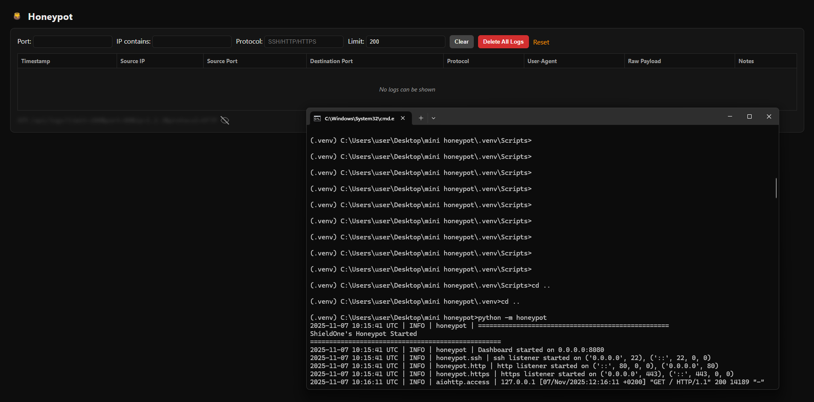

# Honeypot (Python asyncio)

⚠️ **Legal & Safety Disclaimer** ⚠️  
This software is for research and educational purposes only. Operating a honeypot can implicate legal and policy concerns. Consult your legal team before deploying on networks you do not fully control. The system never executes attacker-supplied payloads.

A lightweight honeypot that listens on ports 22 (SSH), 80 (HTTP), and 443 (HTTPS) and passively records inbound traffic. It never executes attacker input, it only logs communications and returns simulated responses.

## Features

- **Listeners**: SSH (22), HTTP (80), HTTPS (443)
- **Logging**: All events saved to `logs/events.jsonl` in JSON Lines format
- **Dashboard**: Web UI at http://localhost:8080 with real-time updates
- **Safety**: Never executes incoming data — only records and simulates responses

## How to Use

### 1. Installation

```bash
# Create virtual environment
python -m venv .venv

# Activate (Windows)
.venv\Scripts\activate

# Activate (Linux/macOS)
source .venv/bin/activate

# Install dependencies
pip install -r requirements.txt
```

### 2. Run the Honeypot

```bash
python -m honeypot
```

The application will:
- Start listening on ports 22, 80, and 443
- Start the dashboard on port 8080
- Show startup banner: `========ShieldOne's Honeypot Started========`

**Note**: On Linux/macOS, ports < 1024 require root. On Windows, run as Administrator. Or use alternate ports (see Configuration below).

### 3. Access the Dashboard

Open your browser: **http://localhost:8080**

- View all captured events in real-time (auto-refreshes every second)
- Filter by Port, IP, or Protocol
- Click **Clear** to reset filters and clear the table
- Click **Delete All Logs** to permanently delete event logs (only `app.log` remains)
- Click the honey pot logo to refresh the page

### 4. Test the Honeypot

These are the simplest tests anyone can perform to verify the honeypot is working. Send test traffic from another terminal:

**Launch the honeypot:**
```bash
python -m honeypot
```


*The honeypot starts listening on ports 22, 80, and 443, and displays the startup banner.*

**Test HTTP (GET request):**
```bash
curl http://localhost:80/?test=123
```


*A simple HTTP GET request is captured and logged. The honeypot responds with a fake HTML page or redirect.*

**Test HTTPS (simulated):**
```bash
curl http://localhost:443/admin
```


*The HTTPS port (443) simulates HTTP without TLS. All requests are logged just like HTTP.*

**Test POST request:**
```bash
curl -X POST http://localhost:80/login \
  -H "Content-Type: application/x-www-form-urlencoded" \
  -d "username=admin&password=test"
```


*POST requests with form data are captured and logged. The honeypot never executes the payload - it only records it.*

**Test SSH:**
```bash
echo "" | nc localhost 22
```

Or use the test script:
```bash
bash tools/send_test_traffic.sh
```

### 5. View Logs

**Event logs** (JSON format):
```bash
cat logs/events.jsonl
```

**Application logs**:
```bash
tail -f logs/app.log
```

## Configuration

Create a `.env` file (or copy from `env.example`) to customize settings:

```env
SSH_PORT=22
HTTP_PORT=80
HTTPS_PORT=443
DASHBOARD_PORT=8080
LOG_PATH=logs/events.jsonl
MAX_CONCURRENT_CLIENTS=100
RATE_LIMIT_PER_MIN=10
RESPOND_WITH_REDIRECT_PROB=0.3
```

**For non-root users**, use alternate ports:
```env
SSH_PORT=2222
HTTP_PORT=8081
HTTPS_PORT=8443
```

## Docker

```bash
# Build
docker build -t mini-honeypot .

# Run
docker run --rm -p 22:22 -p 80:80 -p 443:443 -p 8080:8080 mini-honeypot
```

## Dashboard Features

- **Real-time updates**: Auto-refreshes every 1 second
- **Dynamic filtering**: Filters update as you type (Port, IP, Protocol)
- **Clear button**: Clears filter fields and resets table view
- **Delete All Logs**: Permanently deletes `events.jsonl` (warning prompt included)
- **Interactive logo**: Click honey pot to refresh page

## Log Format

Each line in `logs/events.jsonl` is a JSON object:

```json
{
  "timestamp": "2025-11-02 13:20:53 UTC",
  "src_ip": "::1",
  "src_port": 56531,
  "dst_port": 80,
  "protocol": "HTTP",
  "raw_payload": "GET / HTTP/1.1...",
  "user_agent": "curl/8.14.1",
  "geoip": null,
  "notes": "sent_200"
}
```

## Requirements

- Python 3.10+
- `aiohttp` (for dashboard)
- `python-dotenv` (for configuration)

## Safety Notes

- The honeypot **never executes** any incoming data
- All payloads are logged as text (UTF-8 or base64-encoded if binary)
- No shell access or command execution
- HTTPS port (443) simulates HTTP without TLS (no certificates needed)

## License

MIT License - see [LICENSE](LICENSE) file for details.

## Support

For issues, questions, or contributions, please open an issue on the project repository.
